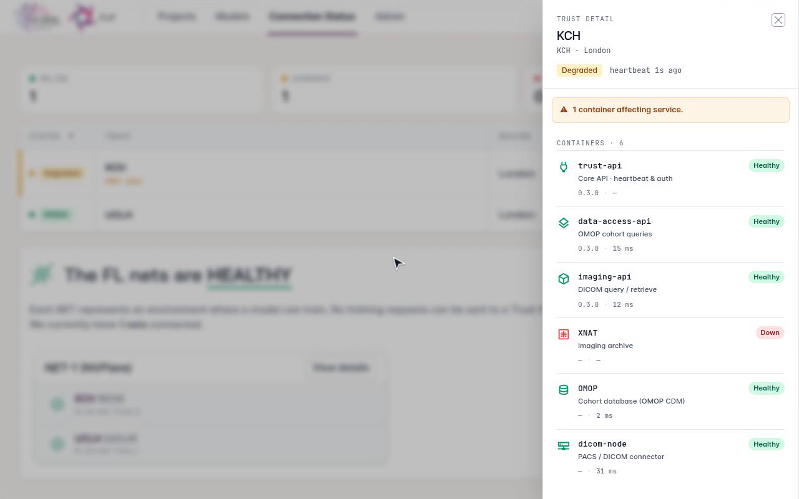

######################
Common user functions
######################

.. warning:: Must have a valid FLIP account. If you do not have one, please liaise with your local FLIP system administrator and/or information asset owner (IAO), and provide your email address and confirmation of which role you require.

Although this page covers functions common to all FLIP users regardless of :ref:`rbac-roles` throughout the various stages involved in preparing an AI model for federated learning, actions related to project process flow are described from the perspective of users with the ``researcher`` role. Users with the ``viewer`` role have read-only access to projects they are assigned to; actions such as creating projects, running queries and uploading files are not available to viewers.

Users with the ``admin`` role may perform all the functions of those with the ``researcher`` role, and are additionally solely responsible for approving and un-staging a project. Each user holds exactly one role (see :ref:`rbac-roles`). For more information, please refer to the :ref:`admin-project-and-user-management` subsection or the broader :ref:`sys-admin` section.

FLIP uses the concept of a *project*, in which multiple AI models can be managed. Projects can have multiple users associated with them, allowing individuals to view and contribute to the project. The typical project flow involves the creation of a project, running a cohort query, staging the project for approval, uploading the model plus any associated files and initiating the training. Once training is complete, the results of training can be downloaded.

To facilitate federated learning and concurrent training of multiple models on the platform, FLIP supports both :term:`NVIDIA FLARE` and the :term:`Flower Framework` as federated learning backends. This page covers concepts such as FL *nets* and job scheduling. For details on framework-specific file requirements and job types, see :ref:`the FL nodes component page <flip-fl-nodes>`.

.. _initial-login:

**************
Initial Login
**************

1. Enter your email address and one-time password
2. Click the 'Login' button
3. Reset password

.. note::

   The password must meet minimum complexity requirements, consisting of at least 8 characters which include upper and lowercase letters, at least one numeric character and at least one special character e.g., ``@``, ``#``, ``&``, ``!``, ``?``, etc.

   Logging into FLIP for the first time.

.. _flip-login:

On subsequent visits, sign in with your email address and password to reach the Projects page.

   Signing in to FLIP.

.. _forgot-password:

***************
Forgot Password
***************

1. Click the 'Forgot Password?' button on the login page
2. Enter the email address for your FLIP account
3. Click the 'Request Code' button
4. After you have received the confirmation code be sent by email, enter the confirmation code and a new password
5. Click the 'Change Password' button

   Resetting a forgotten password.

.. note::

   You may also speak to your local FLIP system administrator and ask them to perform the reset for you, in which case you will receive an email including the confirmation code required to change your password.

   In this case, you will select the 'I have a code' button rather than the 'Request Code' button in the above process.

.. _change-password:

***************
Change Password
***************

While signed in, you can change your password at any time from the account menu.

1. Open the account menu in the top right-hand corner
2. Click 'Change Password'
3. Click the 'Request Code' button to have a confirmation code emailed to you
4. Enter the confirmation code and a new password
5. Click the 'Change Password' button

   Changing your password while signed in.

.. _dark-mode:

*********
Dark Mode
*********

FLIP supports light and dark display modes. Your choice is remembered across sessions.

1. Open the account menu in the top right-hand corner
2. Click 'Dark Mode' to toggle between the light and dark themes

   Switching between light and dark mode.

********
Projects
********

.. warning:: Must be logged into FLIP and have the appropriate :term:`RBAC` :ref:`rbac-roles`.

Once logged in, you'll be presented with the Projects page, in which you can create new projects, view projects that you have created or projects that you have been invited to participate in.

Create Project
==============

1. Click the 'Create Project' button on the top right-hand corner of the page
2. Enter the project name and description
3. If necessary, enter the email addresses of other FLIP users and click the 'Add' button to enable them to view, edit, and/or contribute to the project
4. Click the 'Create Project' button

   Creating a new project.

Edit Project
============

1. Click the 'Edit Project' button
2. Update the project details, such as project name, description and added users
3. Click the 'Update Project' button

   Editing a project.

.. warning::

   Projects may be edited up until the point at which it is staged for approval. If a project needs to be amended after staging, you will need to liaise with your local FLIP administrator *un-stage* the project and re-enable editing.

Delete Project
==============

.. note::

   You must be either the project owner or a user with the ``admin`` role to perform this action.

   Projects can be deleted at any time, but:

   - Any running training sessions will be deleted and no longer accessible
   - Imaging already pulled to each Trust is **deliberately retained** in that Trust's XNAT. Deleting a project
     is a soft delete: the platform record is kept and the deletion audited, but the imaging is not touched.
     Images could be re-pulled from PACS, whereas the segmentations, contours and annotations added during
     data enrichment could not — so a project deletion never destroys them
   - The project therefore remains visible within XNAT to users with access to it there, and is no longer
     reachable through FLIP
   - Removing a Trust's imaging is a **separate administrator action**, carried out at the Trust, and is not
     part of deleting a project

1. Select 'Edit Project'
2. Under 'Advanced Options', click the 'Delete Project' button
3. Enter the project name
4. Click the 'Continue' button

   Deleting a new project.

Project List
============

All projects which you are able to access are visible on the project list, including those which you have created or have been granted access to. Users with the ``admin`` role will be able to view all projects.

Users can apply a filters to view only projects based on, for example, the current user, keywords found in the project and/or project description.

   Filtering list of projects.

Cohort Query
============

Cohort data is stored within a `PostgreSQL <https://www.postgresql.org/>`_ database conforming to the `standard OMOP data model <http://omop-erd.surge.sh/omop_cdm/index.html>`_, extended with the `MI-CDM medical imaging tables <https://www.ncbi.nlm.nih.gov/pmc/articles/PMC11031512/>`_ (``image_occurrence``, ``image_feature`` — successors of the earlier R-CDM radiology tables). The ``image_occurrence`` table has been modified to include an ``accession_id`` field which contains the reference to the associated DICOM series. As this is the field that XNAT will read from when retrieving the associated DICOM series from PACS, the 'accession_id' needs to be included in all queries if relevant images are to be made available.

.. _create-cohort-query:

Create Cohort Query
-------------------

.. note::
    Cohort queries must be a single ``SELECT`` statement against the ``omop`` schema. The query is
    parsed and validated on the trust side (not by keyword matching), so only read-only ``SELECT``
    shapes are accepted — ``INSERT``, ``UPDATE``, ``DELETE``, ``MERGE`` and DDL (``CREATE``,
    ``ALTER``, ``DROP``) are rejected wherever they appear in the query tree, and only literal
    integer ``LIMIT``/``OFFSET`` values are allowed. There is no keyword denylist, so ordinary
    read-only functions such as ``SUBSTRING()`` are permitted. Trust-side execution runs as a
    read-only database role, so anything that slips past the parser cannot mutate the database.

1. Click the 'Create Cohort Query' button in the bottom left corner of the project page
2. Enter a query in SQL format, for example:

   .. code-block:: sql

       SELECT accession_id, concept_name, year_of_birth FROM omop.person p
       JOIN omop.image_occurrence r ON r.Person_Id = p.Person_Id
       JOIN omop.concept c ON p.gender_concept_id = c.concept_id
       WHERE year_of_birth < 1980

3. Click on the 'Run & Save Query' button
4. View results returned in graphical format

   Creating a cohort query.

Edit Cohort Query
=================

.. warning::

   A project's cohort query may be edited up until the point at which it is staged for approval. If a project's cohort query needs to be amended after staging, you will need to liaise with your local FLIP administrator *un-stage* the project and re-enable editing.

In the event users want to amend the project cohort query or need to due to query timeouts, they can do so and re-run the query.

1. On the Project page, click the 'View Query' button
2. The cohort query can be amended and re-run following the steps outlined in the :ref:`create-cohort-query` section

Project Staging
===============

.. note::

   You will be able to 'stage' your project for approval once the project has a cohort query saved.

Staging allows you to select which Trusts will be requested for approval and included in the model training cycle, i.e. use the toggle switch next to each Trust to include/exclude them.

.. warning::

   Once staged, the project details and cohort query are locked from further editing. If a project's details and/or cohort query needs to be amended after staging, you will need to liaise with your local FLIP administrator *un-stage* the project and re-enable editing.

   Staging a project.

Project Approval
================

Once staged for approval, it is the responsibility of the FLIP Central Hub Admin to complete the approval process **offline** and update the FLIP platform with the outcome.

.. note::

   Following approval, any Trusts which have declined to participate in the project will be unavailable and excluded from model training.

Imaging Project Status
======================

Following project approval, a corresponding XNAT project will be generated at each participating Trust and relevant imaging data will be imported from their respective PACS systems. For more information on this integration, please see the :ref:`flip-xnat` page.

To view the progress of the imaging data import at each participating Trust, users can refer to the Imaging Project Status section on the project page.

   Imaging status overview

.. note::

   Importing large sets of studies from PACS systems can take a very long time and individual imports may fail if the system is under too much strain. Overtime, FLIP will automatically reimport failed studies as indicated by the reimport count.
   Once the reimport cap is reached, failed studies will no longe be reimported. If there are still failures present, please contact an XNAT administrator. Manual intervention may be needed.

   Reimport cap has been reached

*******
Models
*******

.. warning:: Project must be approved before proceeding with creating models and initiating training.

Create Model
=============

1. Navigate to the project page
2. Click the 'Create Model' button
3. Enter a name and brief description
4. Click the 'Create Model' button

   Creating a model.

Edit Model
==========

.. note::

   Users can edit the model up until the point at which the model's training has been initiated.

1. Navigate to the project page
2. Click the 'Edit Model' button
3. Update the model details, such as model name and description

   Editing a model.

Delete Model
============

.. note::

   You must be either the project owner or a user with the ``admin`` role to perform this action.

   Models can be deleted at any time, but if training is in progress at the time of deletion, the model training will be stopped and the model will no longer be accessible.

1. Navigate to the project page
2. Click the 'Edit Model' button
3. Under 'Advanced Options', click the 'Delete Model' button
4. Enter the model name
5. Click the 'Continue' button

   Deleting a model.

Model Files
===========

.. note::

   A model must be created before proceeding to upload model files and prepare the model for training.

There is no single list of required files. What a model must contain depends on its **job type**
— the kind of federated job it runs, such as federated averaging or evaluation — and on which FL
backend your platform is running. An app declares its job type with the ``job_type`` key in
``config.json``. Every NVFLARE app carries a ``config.json``, because it is itself a required file
for those job types; a Flower app only needs one in order to run a job type other than the default.
Where the key — or the file itself — is absent, the ``standard`` job type is assumed.

**You do not need to look this up.** FLIP tells you which files your model needs, in two places on
the model page:

- The Model Files panel shows the job type currently detected from your uploaded ``config.json``.
- The Training panel lists the files that job type requires, and highlights any that are still
  missing.

Both update as soon as you upload or replace ``config.json``, and training cannot be initiated
until every required file has been uploaded.

Files beyond the required set may be uploaded freely — anything your code imports (helper modules,
transforms) is bundled with the app and shipped to the participating Trusts. Two things do not
follow that rule: a file whose name matches one the platform's own app template supplies is quietly
dropped in favour of the template's copy, and a checkpoint declared for server-side use stays on the
FL server rather than travelling to the Trusts. Both are covered under
:ref:`fl-required-files` on the FL nodes component page.

The full per-job-type file lists, and the configuration each backend accepts, are documented on
the :ref:`FL nodes component page <flip-fl-nodes>`. For worked examples of complete, working apps,
see the `FLIP tutorials <https://github.com/londonaicentre/FLIP/tree/develop/fl-tutorials>`_.

.. warning::

   Please ensure that any model files uploaded to FLIP have been tested locally using the FLIP tutorials workflow, and have been validated to ensure they are free of syntax errors.

   Linting tools such as `Pylint <https://pypi.org/project/pylint/>`_ and `JSON Lint <https://www.npmjs.com/package/jsonlint>`_ can provide a simple way to validate any Python or JSON are free of errors before uploading.

Upload Files
------------

1. Navigate to the project page
2. Navigate to the Model Files section on the left-hand side of the model page
3. Either browse to the files on your local file system or drag and drop them into the box on screen
4. You will receive confirmation once your files have successfully uploaded
5. Each file is then checked. A magnifying-glass icon marks a file as being checked; it becomes a
   document icon once the check passes and the file is ready to use

.. note::

   **Every uploaded file is held in a staging area and released only after it has been checked.**
   Until then it cannot be used for training and is never sent to a trust.

   Files that carry Python pickle data (``.pt``, ``.pth``, ``.pkl``, ``.pickle``) — including model
   checkpoints — are **scanned for unsafe content**, because loading such a file executes whatever it
   contains. A file that fails this scan is marked with a red virus icon and deleted from storage.
   Delete the entry and upload a corrected file to continue.

   .. warning::

      **Your Python source is not blocked on the basis of what it does.** ``.py`` files are checked
      for type and released like any other file, then executed as-is on every participating trust.
      A non-blocking scan flags common risky patterns (``subprocess``, ``os.system``, ``eval``,
      hardcoded credentials — and, since the scan uses Bandit's default rule set, some routine
      patterns in ML code such as ``torch.load`` or ``assert``) as an amber indicator on the
      model's file list, visible to you as the uploader and to anyone else who later opens the
      model page. This is an advisory signal, not a gate — it does not stop obfuscated or
      otherwise-undetected code from running, and an indicator does not by itself mean the file is
      unsafe. Only upload code you have written or reviewed yourself, and treat code from third
      parties as untrusted.

   Only recognised file types may be uploaded (by default ``.py``, ``.json``, ``.toml``, ``.pt``,
   ``.pth``, ``.pkl``, ``.txt``, ``.yaml``, ``.yml`` and ``.safetensors``). Anything else — including
   archives such as ``.zip`` — is refused at upload time with a message listing the accepted types.

   Training cannot start until every file has been released.

Checking starts as soon as a file is uploaded and usually finishes within seconds, though scanning a
large checkpoint takes longer. You can leave the page while it runs — it continues on the server and
the status updates when you return.

If model files need to be managed further after uploading, the uploader function allows files to be downloaded, removed and re-uploaded.

   Uploading files.

.. _training-configuration:

Training Configuration
----------------------

Alongside your code, an app carries a small configuration file that sets how the federated run
behaves — how many rounds it trains for, how client updates are combined, and any settings your
own code reads.

Where that configuration lives, and which settings are available, depends on the FL backend:

- **NVIDIA FLARE apps** are configured through ``config.json``, which is one of the required files
  for every NVFLARE job type. As well as declaring ``job_type``, it may set platform-recognised
  keys such as ``GLOBAL_ROUNDS`` and ``LOCAL_ROUNDS``.
- **Flower apps** take their run configuration from the platform's app template, which your app
  can override with a ``config.toml`` file. Flower apps do not use the NVFLARE keys.

For NVFLARE apps, any key the platform does not recognise is passed through untouched, for your own
code to read at runtime — which is how the tutorials carry app-specific settings such as learning
rate or validation split. Flower works the other way round: ``config.toml`` may only override keys
the app template already declares, and a key it does not declare fails the run at submission rather
than being ignored.

Every platform-recognised key has a default, so an app that sets only ``job_type`` will still run.
For the full list of keys, their accepted values and defaults per backend, see
:ref:`fl-training-configuration` on the FL nodes component page.

View Files
----------

1. Navigate to the project page
2. Navigate to the Model Files section on the left-hand side of the model page
3. Click the download icon to view the contents of a file that has been uploaded

   Managing uploaded files.

Delete Files
------------

1. Navigate to the project page
2. Navigate to the Model Files section on the left-hand side of the model page
3. Click the bin icon to delete a file that has been uploaded

Training
========

FLIP allows for multiple models to be deployed to and trained at multiple Trust sites concurrently, using either :term:`NVIDIA FLARE` or the :term:`Flower Framework` to train, test and aggregate at each of the relevant nodes and report back to the user interface once the training is complete.

FLIP uses the concept of *nets* that are deployed on the Central Hub and remote hardware at each Trust. Each *net* consists of a controller and worker (to manage the model training cycle) and FLIP uses a task scheduler to manage the resources available on the hardware at Trust sites. The scheduler maintains a queue of waiting *tasks*, when a *net* becomes free a *task* is assigned to it.

This scheduling capability means model developers can submit their model for training via the UI and need not be concerned with matters such as GPU capacity or existing jobs that are running/queued. When initiating training the platform will check for available nets and assign the model training to an available net.

While a model is waiting for a net, its place in the queue is shown alongside its status — e.g. ``Model Queued (2)``, where position 1 is the next model to start — both on the Models page and on the model's page, and the model's Live activity feed logs a new line each time the model moves up the queue.

Initiate Training
-----------------

When model files have been uploaded, you will then need to confirm that the dataset has been enriched and specify the number of local iterations.

.. note::

   You must confirm the data enrichment step is complete (even if no enrichment of the dataset was required and/or actually performed) before training can commence.

.. important::

   If your model trains against labels that are **not** in :term:`OMOP` — segmentation masks and other image-derived annotations — those must be uploaded into each Trust's XNAT *before* you confirm this step, or training will start and then fail with no usable samples. Labels that *are* in OMOP, such as a lab result or a coded report finding, need no upload: project them as a column in your cohort query instead. See :ref:`data-enrichment` for both routes.

1. Navigate to project page
2. On the right-hand side, toggle the button to confirm the dataset has been enriched
3. Click the 'Initiate Training' button to start the training cycle
4. Once the training cycle has been initiated, the progress bar at the top of the page will update as the various stages of the training cycle complete i.e., a green tick will appear

On the right-hand side of the page a window will also pop up to provided detailed status updates i.e., with date and time stamps, against each activity. The status messages show the scheduling activities, including queuing, *net* assignment, training in progress and training complete.

   Initiating model training.

Stop Training
-------------

.. note::

   If the training has already completed the 'Stop Training' option will be greyed out (see :ref:`view-results`).

1. Click the 'Actions' drop-down menu
2. Click the 'Stop Training' button
3. When the model training has been stopped, the progress bar will show at which stage the process was stopped

While the model is still queued (the status shows 'Model Queued', before training has started) the same button
reads **'Abort job'** instead: clicking it removes the job from the queue, marks the model as Stopped, and
immediately releases the training *net* so the next queued job can start. A stopped model expects no results —
'Download Results' stays disabled — but it can be initiated for training again.

   Stopping model training.

.. _view-results:

View Results
------------

.. note::

   Model training must be completed before users are able to download the results.

1. Click the 'Actions' drop-down menu
2. Click the 'Download Results' button
3. Open the .zip file downloaded to your local machine to view the results

   Downloading model training results.

Metrics
-------

During the training cycle, any metrics specified by the model developer e.g., loss function, average score, etc., are displayed during and following the training cycle.

Hovering over the graphs at various points will display the values.

   Viewing model training metrics.

.. _connection-status:

*****************
Connection Status
*****************

The Connection Status page shows the live state of the federation. Each participating Trust reports the health of its core platform services (trust-api, data-access-api, imaging-api, XNAT, OMOP and the PACS/DICOM link), and its state is derived from those reports: Offline when the Trust has stopped sending heartbeats, Degraded when any other service is down or degraded, otherwise Online. The list can also be viewed as a radial topology.

The Services column shows one status dot per container. Clicking a Trust row opens a detail drawer listing each container's status, running version and probe response time — so you can see *why* a Trust is degraded without access to the Trust's own network. The page and the drawer are available to every signed-in user, not only administrators: if a project stalls, you can check whether the Trust holding your data is reporting a failing service before raising it with the platform team. A Trust that has not reported container health (or whose report has gone stale) shows grey "No data" markers and falls back to heartbeat-only state.

   The Trust detail drawer: this Trust is Degraded because its XNAT is unreachable.

The FL nets card reports the FL client-to-server connectivity for each net — that is, whether each Trust's FL client is connected. No training requests can be sent to a Trust whose FL client is offline.

   Viewing the federation connection status and a Trust's container health.
